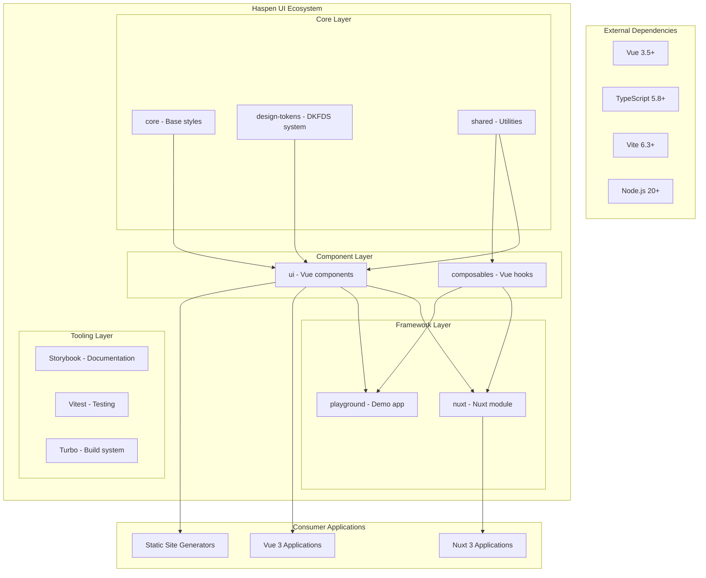
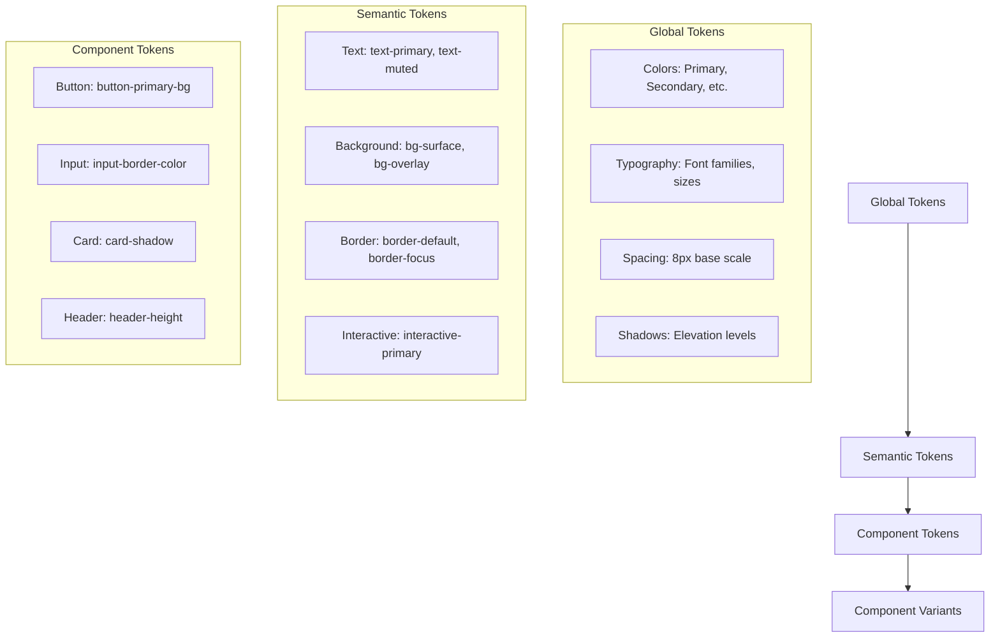
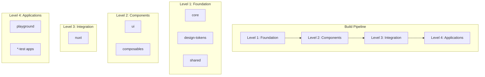
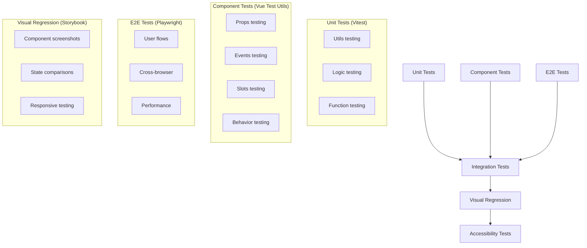

# Haspen UI - Architecture Documentation

## 🏗️ System Architecture Overview

### Design Philosophy

Haspen UI is built on four core principles:

1. **Atomic Design Methodology**: Components are organized from atoms to pages
2. **Design Token-Driven Development**: All styling decisions derive from centralized tokens
3. **DKFDS Compliance**: Full implementation of Danish government design standards
4. **Developer Experience**: Modern tooling with TypeScript, Vue 3, and automated workflows

### System Boundaries



## 📦 Package Architecture

### Core Packages

#### `@haspen-ui/core`

**Purpose**: Foundation layer with CSS reset and base styles **Dependencies**: None **Exports**:

```typescript
// CSS normalization and base styles
import '@haspen-ui/core/dist/index.css';
```

#### `@haspen-ui/design-tokens`

**Purpose**: Complete DKFDS implementation with tokens, functions, and utilities **Dependencies**:
None **Architecture**:

```
src/
├── core/              # Design token definitions
│   ├── _colors.scss   # Color palette (100+ colors)
│   ├── _typography.scss # Font system (IBM Plex Sans)
│   ├── _spacing.scss  # 8px-based spacing scale
│   ├── _shadows.scss  # Elevation system
│   ├── _radius.scss   # Border radius tokens
│   └── _z-index.scss  # Z-index scale
├── functions/         # SCSS functions
│   └── _index.scss    # color(), font-size(), units(), etc.
├── mixins/           # Reusable mixins
│   └── _index.scss   # Typography, layout, component mixins
└── utilities/        # CSS utility classes
    ├── _spacing.scss     # Margin/padding utilities
    ├── _display.scss     # Display utilities
    ├── _flexbox.scss     # Flexbox utilities
    ├── _width.scss       # Width utilities
    ├── _background.scss  # Background utilities
    └── _position.scss    # Position utilities
```

#### `@haspen-ui/shared`

**Purpose**: Framework-agnostic utilities and helpers **Dependencies**: `@haspen-ui/core`
**Exports**:

```typescript
// Danish-specific utilities
export { isValidCPR, formatDanishPhone } from './utils/validation';
export { formatCurrency, formatDanishDate } from './utils/format';

// General utilities
export { debounce, throttle } from './helpers';
export type { BaseComponent, ComponentSize } from './types';
```

### Component Layer

#### `@haspen-ui/ui`

**Purpose**: Vue 3 component library following atomic design **Dependencies**: `@haspen-ui/core`,
`@haspen-ui/shared` **Architecture**:

```
src/
├── atoms/           # Basic building blocks
│   ├── Button/
│   ├── Input/
│   ├── Icon/
│   └── Label/
├── molecules/       # Component combinations
│   ├── FormField/
│   ├── Card/
│   └── SearchBox/
├── organisms/       # Complex components
│   ├── Header/
│   ├── Navigation/
│   └── DataTable/
├── templates/       # Page layouts
│   ├── DefaultLayout/
│   └── DashboardLayout/
└── pages/          # Complete pages
    ├── LoginPage/
    └── DashboardPage/
```

**Component Structure**:

```
ComponentName/
├── ComponentName.vue        # Vue SFC with Composition API
├── ComponentName.stories.ts # Storybook documentation
├── ComponentName.test.ts    # Vitest unit tests
├── ComponentName.scss       # Component-specific styles
├── types.ts                # TypeScript interfaces
├── index.ts                # Named exports
└── README.md               # Component documentation
```

#### `@haspen-ui/composables`

**Purpose**: Vue 3 composables for shared logic **Dependencies**: `@haspen-ui/core`,
`@haspen-ui/shared` **Exports**:

```typescript
// DOM utilities
export { useClickOutside } from './clickOutside';
export { useLocalStorage } from './localStorage';

// Form utilities
export { useFormValidation } from './formValidation';
export { useDanishValidation } from './danishValidation';

// UI utilities
export { useBreakpoints } from './breakpoints';
export { useTheme } from './theme';
```

### Integration Layer

#### `@haspen-ui/nuxt`

**Purpose**: Nuxt 3 module for seamless integration **Dependencies**: `@haspen-ui/ui`,
`@haspen-ui/composables` **Features**:

- Auto-imports for components and composables
- SCSS preprocessing configuration
- Build optimizations
- SSR compatibility

#### `@haspen-ui/playground`

**Purpose**: Development and demonstration application **Dependencies**: All packages **Features**:

- Component showcase
- Interactive examples
- Development testing
- Integration examples

## 🎨 Design System Architecture

### Design Token Hierarchy



### SCSS Function System

**Token Access Functions**:

```scss
// Color tokens
.my-component {
  color: color('primary'); // #747474
  background: color('success'); // #358438
  border-color: color('error'); // #CC2936
}

// Typography tokens
.my-text {
  font-size: font-size('lg'); // 1.8rem (18px)
  line-height: line-height('normal'); // 1.5
  font-family: font-family('primary'); // IBM Plex Sans
}

// Spacing tokens
.my-container {
  padding: units(4); // 32px (4 * 8px)
  margin: spacing('md'); // 1.6rem
  gap: spacing('sm'); // 0.8rem
}

// Shadow tokens
.my-card {
  box-shadow: shadow('medium'); // 0 4px 8px rgba(0,0,0,0.12)...
  border-radius: radius('md'); // 0.5rem
  z-index: z-index('modal'); // 1000
}
```

### Mixin System

**Typography Mixins**:

```scss
.heading-large {
  @include h1-typography;
  // font-family: IBM Plex Sans
  // font-size: 3.2rem (mobile) → 4.8rem (desktop)
  // font-weight: 600
  // line-height: 1.2
}

.body-text {
  @include body-copy-text;
  // font-family: IBM Plex Sans
  // font-size: 1.6rem
  // line-height: 1.5
}
```

**Layout Mixins**:

```scss
.page-container {
  @include container; // Max-width with responsive padding
  @include grid-row; // CSS Grid row setup
}

.content-section {
  @include grid-col(12, 8, 6); // 12 cols mobile, 8 tablet, 6 desktop
}
```

**Component Mixins**:

```scss
.primary-button {
  @include button-primary;
  // All primary button styles
  // Hover, focus, active states
  // Accessibility features
}

.form-input {
  @include form-input;
  // Standard form input styles
  // Focus states, validation styles
}
```

## 🔧 Build System Architecture

### Turborepo Pipeline



### Build Tools Configuration

**Package Building (tsup)**:

```typescript
// tsup.config.ts
export default defineConfig({
  entry: ['src/index.ts'],
  format: ['esm', 'cjs'],
  dts: true,
  clean: true,
  sourcemap: true,
  external: ['vue'],
  esbuildOptions(options) {
    options.banner = {
      js: '/* Haspen UI Component Library */',
    };
  },
});
```

**Application Building (Vite)**:

```typescript
// vite.config.ts
export default defineConfig({
  plugins: [vue()],
  build: {
    lib: {
      entry: 'src/index.ts',
      name: 'HaspenUI',
      formats: ['es', 'umd'],
    },
    rollupOptions: {
      external: ['vue'],
      output: {
        globals: {
          vue: 'Vue',
        },
      },
    },
  },
});
```

## 🧪 Testing Architecture

### Testing Strategy



### Test Configuration

**Vitest Setup**:

```typescript
// vitest.config.ts
export default defineConfig({
  plugins: [vue()],
  test: {
    environment: 'jsdom',
    coverage: {
      provider: 'v8',
      reporter: ['text', 'json', 'html', 'lcov'],
      threshold: {
        global: {
          branches: 90,
          functions: 90,
          lines: 90,
          statements: 90,
        },
      },
    },
    setupFiles: ['./src/test-setup.ts'],
  },
});
```

**Component Test Pattern**:

```typescript
// Component.test.ts
describe('ComponentName', () => {
  // Props testing
  it('renders with all prop variants', () => {
    const props = { variant: 'primary', size: 'lg' };
    const wrapper = mount(Component, { props });
    expect(wrapper.classes()).toContain('component--primary');
  });

  // Event testing
  it('emits events on interaction', async () => {
    const wrapper = mount(Component);
    await wrapper.trigger('click');
    expect(wrapper.emitted('click')).toBeTruthy();
  });

  // Slot testing
  it('renders slot content correctly', () => {
    const wrapper = mount(Component, {
      slots: { default: 'Test content' },
    });
    expect(wrapper.text()).toContain('Test content');
  });

  // Accessibility testing
  it('meets accessibility requirements', () => {
    const wrapper = mount(Component);
    expect(wrapper.attributes('aria-label')).toBeDefined();
  });
});
```

## 🔐 Security Architecture

### Input Validation

```typescript
// Danish-specific validation
export const isValidCPR = (cpr: string): boolean => {
  // CPR format: DDMMYY-XXXX or DDMMYYXXXX
  const cleaned = cpr.replace(/\D/g, '');
  if (cleaned.length !== 10) return false;

  // Validate date portion
  const day = parseInt(cleaned.substring(0, 2));
  const month = parseInt(cleaned.substring(2, 4));
  const year = parseInt(cleaned.substring(4, 6));

  // Additional validation logic...
  return true;
};
```

### Content Security Policy

```typescript
// nuxt.config.ts
export default defineNuxtConfig({
  security: {
    headers: {
      contentSecurityPolicy: {
        'img-src': ["'self'", 'data:', 'https:'],
        'font-src': ["'self'", 'https://fonts.gstatic.com'],
        'style-src': ["'self'", "'unsafe-inline'", 'https://fonts.googleapis.com'],
      },
    },
  },
});
```

### Sanitization

```typescript
// HTML sanitization for user content
import DOMPurify from 'dompurify';

export const sanitizeHTML = (dirty: string): string => {
  return DOMPurify.sanitize(dirty, {
    ALLOWED_TAGS: ['b', 'i', 'em', 'strong', 'a', 'p', 'br'],
    ALLOWED_ATTR: ['href', 'title'],
  });
};
```

## 📊 Performance Architecture

### Bundle Optimization

**Code Splitting Strategy**:

```typescript
// Lazy loading for large components
const DataTable = defineAsyncComponent(() => import('./DataTable.vue'));
const Charts = defineAsyncComponent(() => import('./Charts.vue'));

// Tree-shaking friendly exports
export { Button, Input, Card } from './components';
export type { ButtonProps, InputProps } from './types';
```

**CSS Optimization**:

```scss
// Critical CSS extraction
@use 'sass:meta';

// Only include used utilities
@if meta.global-variable-exists('include-utilities') {
  @if $include-utilities {
    @import 'utilities';
  }
}
```

### Runtime Performance

**Vue 3 Optimizations**:

```vue
<script setup lang="ts">
  // Reactive optimizations
  const props = defineProps<Props>();
  const slots = defineSlots<Slots>();

  // Computed caching
  const computedValue = computed(() => {
    return expensiveCalculation(props.data);
  });

  // Event handler memoization
  const handleClick = useCallback(
    (event: Event) => {
      // Handler logic
    },
    [props.id],
  );
</script>
```

## 🌐 Internationalization Architecture

### Danish Localization Support

```typescript
// Locale-specific formatting
export const formatDanishCurrency = (
  amount: number,
  options?: Intl.NumberFormatOptions,
): string => {
  return new Intl.NumberFormat('da-DK', {
    style: 'currency',
    currency: 'DKK',
    minimumFractionDigits: 2,
    ...options,
  }).format(amount);
};

// Danish date formatting
export const formatDanishDate = (
  date: Date,
  format: 'short' | 'medium' | 'long' = 'medium',
): string => {
  const options: Intl.DateTimeFormatOptions = {
    short: { day: 'numeric', month: 'numeric', year: 'numeric' },
    medium: { day: 'numeric', month: 'long', year: 'numeric' },
    long: { weekday: 'long', day: 'numeric', month: 'long', year: 'numeric' },
  }[format];

  return new Intl.DateTimeFormat('da-DK', options).format(date);
};
```

### Multi-language Support Architecture

```typescript
// Extensible i18n structure
interface TranslationKeys {
  common: {
    save: string;
    cancel: string;
    delete: string;
  };
  forms: {
    required: string;
    invalid: string;
    success: string;
  };
  components: {
    button: {
      loading: string;
    };
    datePicker: {
      selectDate: string;
    };
  };
}

// Type-safe translation function
export const useTranslation = (): {
  t: (key: keyof TranslationKeys) => string;
  locale: Ref<string>;
} => {
  // Implementation
};
```

This architecture document provides the foundation for understanding, maintaining, and extending the
Haspen UI design system. Each layer is designed for modularity, scalability, and maintainability
while adhering to Danish design standards and modern web development practices.
