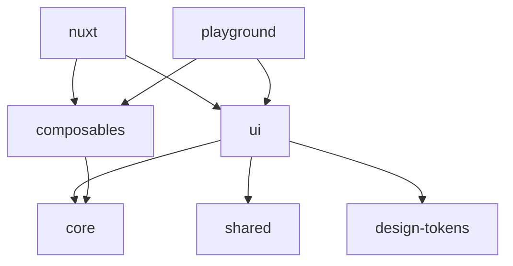

# 🛠 Development Guide

This guide provides detailed information for developing the HäspenUI Design System.

## 📦 Monorepo Architecture

### Package Structure

```
haspen-ui/
├── packages/              # Core packages
│   ├── ui/               # Vue components
│   ├── core/             # Types and constants
│   ├── shared/           # Utilities and helpers
│   ├── composables/      # Vue composables
│   ├── design-tokens/    # Design tokens
│   └── nuxt/             # Nuxt module
├── apps/                 # Demo applications
├── .storybook/           # Storybook configuration
└── docs/                 # Documentation
```

### Package Dependencies



## 🎨 Component Development

### Atomic Design Structure

Components follow atomic design principles:

- **Atoms** - Basic building blocks (Button, Input, Icon)
- **Molecules** - Simple component groups (FormField, Card)
- **Organisms** - Complex components (Header, Form)
- **Templates** - Page-level layouts
- **Pages** - Complete page examples

### Creating a Component

#### 1. Component File Structure

```
packages/ui/src/atoms/ComponentName/
├── ComponentName.vue        # Component implementation
├── ComponentName.stories.ts # Storybook stories
├── ComponentName.test.ts    # Unit tests
├── ComponentName.scss       # Styles (optional)
├── types.ts                # TypeScript types
└── index.ts                # Export file
```

#### 2. Component Template

```vue
<!-- ComponentName.vue -->
<template>
  <div :class="classes">
    <slot />
  </div>
</template>

<script setup lang="ts">
  import { computed } from 'vue';
  import type { ComponentNameProps } from './types';

  const props = withDefaults(defineProps<ComponentNameProps>(), {
    variant: 'primary',
    size: 'md',
  });

  const classes = computed(() => [
    'haspen-component-name',
    `haspen-component-name--${props.variant}`,
    `haspen-component-name--${props.size}`,
  ]);
</script>

<style lang="scss" scoped>
  @import './ComponentName.scss';
</style>
```

#### 3. Types Definition

```typescript
// types.ts
export interface ComponentNameProps {
  variant?: 'primary' | 'secondary';
  size?: 'sm' | 'md' | 'lg';
  disabled?: boolean;
}
```

#### 4. Storybook Stories

```typescript
// ComponentName.stories.ts
import type { Meta, StoryObj } from '@storybook/vue3';
import ComponentName from './ComponentName.vue';

const meta: Meta<typeof ComponentName> = {
  title: 'Atoms/ComponentName',
  component: ComponentName,
  parameters: {
    layout: 'centered',
  },
  tags: ['autodocs'],
  argTypes: {
    variant: {
      control: 'select',
      options: ['primary', 'secondary'],
    },
  },
};

export default meta;
type Story = StoryObj<typeof meta>;

export const Default: Story = {
  args: {
    default: 'Component content',
  },
};
```

#### 5. Unit Tests

```typescript
// ComponentName.test.ts
import { describe, it, expect } from 'vitest';
import { mount } from '@vue/test-utils';
import ComponentName from './ComponentName.vue';

describe('ComponentName', () => {
  it('renders properly', () => {
    const wrapper = mount(ComponentName, {
      props: {
        variant: 'primary',
      },
    });
    expect(wrapper.exists()).toBe(true);
  });
});
```

## 🧪 Testing

### Running Tests

```bash
# Run all tests
pnpm test

# Run tests in watch mode
pnpm test:watch

# Run tests with coverage
pnpm test:coverage

# Run tests for specific package
pnpm test --filter=@haspen-ui/ui
```

### Test Structure

- Unit tests: Test individual components in isolation
- Integration tests: Test component interactions
- Visual tests: Storybook + Chromatic for visual regression

## 📏 Code Standards

### TypeScript

- Strict mode enabled
- Use explicit types (avoid `any`)
- Export types from `types.ts` files
- Use `interface` for object types

### Vue 3

- Use Composition API with `<script setup>`
- Props should have TypeScript interfaces
- Use `computed` for reactive derived state
- Emit events with proper TypeScript types

### Styling

- Use SCSS for component styles
- Follow BEM naming convention
- Scope styles with `scoped` attribute
- Use design tokens from `@haspen-ui/design-tokens`

### Git Workflow

1. Create feature branch from `develop`
2. Make changes and commit with conventional commits
3. Push and create PR to `develop`
4. After review, merge to `develop`
5. Periodically merge `develop` to `main` for releases

### Commit Convention

```
feat: add new button variant
fix: resolve click handler issue
docs: update component documentation
style: format code
refactor: simplify button logic
test: add unit tests for button
chore: update dependencies
```

## 🚀 Build & Release

### Building Packages

```bash
# Build all packages
pnpm build

# Build specific package
pnpm build --filter=@haspen-ui/ui

# Build in watch mode
pnpm dev
```

### Release Process

1. Ensure all tests pass
2. Update version in package.json
3. Update CHANGELOG.md
4. Create git tag
5. Push to main branch
6. GitHub Actions will publish to npm

## 🔧 Tooling

### VS Code Extensions

- Volar (Vue Language Features)
- TypeScript Vue Plugin
- ESLint
- Prettier
- SCSS IntelliSense

### Useful Commands

```bash
# Format code
pnpm format

# Lint code
pnpm lint

# Type check
pnpm typecheck

# Clean build artifacts
pnpm clean
```

## 📚 Resources

- [Vue 3 Documentation](https://vuejs.org/)
- [TypeScript Documentation](https://www.typescriptlang.org/)
- [Storybook Documentation](https://storybook.js.org/)
- [Atomic Design Methodology](https://atomicdesign.bradfrost.com/)

## 🤝 Contributing

1. Fork the repository
2. Create your feature branch
3. Commit your changes
4. Push to the branch
5. Create a Pull Request

### PR Guidelines

- Include tests for new features
- Update documentation
- Follow code standards
- Add Storybook stories
- Ensure CI passes

## 🐛 Debugging

### Common Issues

**Issue**: Component not showing in Storybook

- Check story file naming (`.stories.ts`)
- Verify story exports
- Restart Storybook server

**Issue**: TypeScript errors

- Run `pnpm typecheck`
- Check for missing types
- Ensure proper imports

**Issue**: Build failures

- Clean node_modules: `pnpm clean && pnpm install`
- Check for circular dependencies
- Verify package.json exports

## 📈 Performance

### Best Practices

- Use dynamic imports for large components
- Implement proper tree-shaking
- Minimize bundle size
- Use CSS custom properties for theming
- Lazy load heavy dependencies

### Monitoring

- Use Storybook's performance addon
- Check bundle sizes with `pnpm build`
- Monitor component render times
- Use Vue DevTools for debugging
